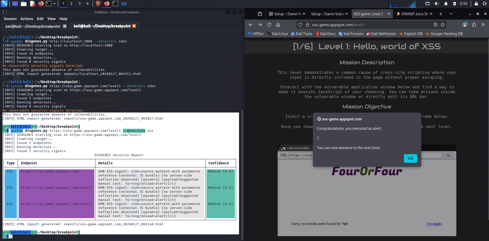
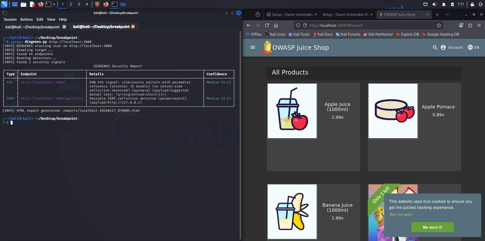
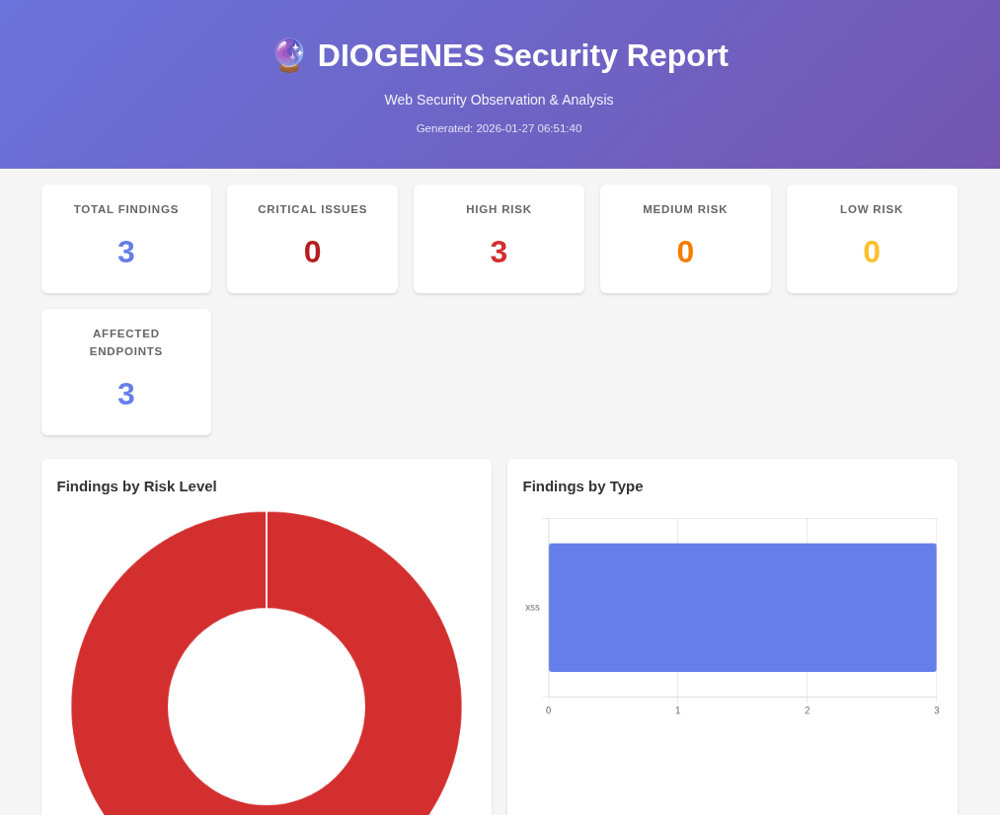
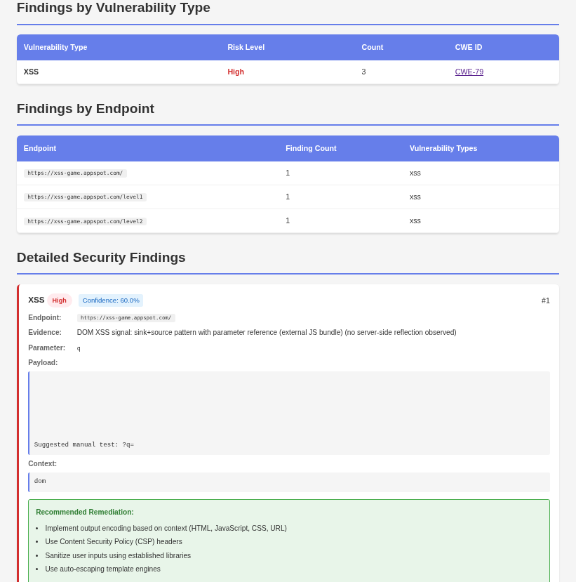

<p align="center">
  
</p>

<h1 align="center">DIOGENES v1.2</h1>
<p align="center"><i>High-Performance Web Security Scanner for Developers</i></p>

---

## 🚀 Features

- **XSS Detection** - Reflected, Stored, DOM-based
- **SQL Injection** - Error patterns + DB fingerprinting
- **CSRF** - Missing token detection (Rails, Django, Laravel conventions)
- **SSRF** - Server-side request forgery
- **IDOR** - Access control issues (supports JWT/API keys)
- **Concurrent Scanning** - 3-5x faster with ThreadPoolExecutor
- **Rate Limiting** - Configurable delays to prevent bans
- **Smart Crawling** - SPA support with JS endpoint extraction
- **🆕 Scan Profiles** - Stealth, balanced, aggressive, quick modes
- **🆕 Security Hardening** - SSRF protection, input validation
- **🆕 Configuration System** - JSON configs, environment variables
- **🆕 Comprehensive Testing** - Unit tests for all core components


## 🏛️ Philosophy

> *Inspired by Diogenes of Sinope — questioning assumptions and exposing weak logic.*

**DIOGENES** does not shout.  
It does not guess.

It **observes**.  
It **compares**.  
It **reasons**.

---

## 📦 Installation

```bash
git clone https://github.com/abdorhl/diogenes.git
cd diogenes
pip install -r requirements.txt
```

---

## 🎯 Quick Start

### Basic Scan
```bash
python diogenes.py https://target.com
```

### 🆕 Use Scan Profiles
```bash
# Stealth mode (slow, avoids detection)
python diogenes.py https://target.com --profile stealth

# Aggressive mode (fast, thorough)
python diogenes.py https://target.com --profile aggressive

# Quick mode (fastest)
python diogenes.py https://target.com --profile quick
```

### 🆕 Use Configuration Files
```bash
python diogenes.py https://target.com --config examples/config_stealth.json
```

### Fast Scan (10 threads)
```bash
python diogenes.py https://target.com --threads 10
```

### ⚡ Quick Scan (Smart Early-Exit - Recommended for Large Apps)
```bash
python diogenes.py https://target.com --quick-scan --threads 10
```
> **Perfect for Laravel apps with 100+ endpoints!** Skips remaining payloads if no vulnerability signals detected early, reducing scan time by 60-80%.

### Production Scan (rate limited)
```bash
python diogenes.py https://target.com --delay 1.0 --html report.html
```

### IDOR with JWT
```bash
python diogenes.py https://api.target.com \
  --identity-a user1.json \
  --identity-b user2.json \
  --detectors idor
```

### Targeted Testing
```bash
python diogenes.py https://target.com --endpoints-file endpoints.txt
```

---

## 📸 Screenshots

<p align="center">
  
  <br><i>CLI Output with Findings</i>
</p>
<p align="center">
  
  <br><i>CLI Output with Findings</i>
</p>
<p align="center">
  
  <br><i>HTML Report Dashboard</i>
</p>

<p align="center">
  
  <br><i>Finding Details</i>
</p>


---

## 🔧 CLI Options

| Flag | Description | Example |
|------|-------------|---------|
| `--profile` | **Scan profile** (stealth/balanced/aggressive/quick) | `--profile stealth` |
| `--config` | **Load config file** | `--config scan.json` |
| `--depth N` | Crawl depth | `--depth 3` |
| `--delay N` | Delay between requests (seconds) | `--delay 1.0` |
| `--threads N` | Concurrent workers | `--threads 10` |
| `--quick-scan` | **Smart early-exit mode** | `--quick-scan` |
| `--no-concurrent` | Sequential mode | `--no-concurrent` |
| `--endpoints-file` | Load endpoints from file | `--endpoints-file api.txt` |
| `--detectors` | Specific detectors | `--detectors xss,sqli` |
| `--cookie` | Session cookies | `--cookie "session=abc"` |
| `--header` | Custom headers | `--header "Auth: Bearer token"` |
| `--identity-a/b` | IDOR testing identities | `--identity-a user1.json` |
| `--output` | Format (table/json) | `--output json` |
| `--html` | HTML report path | `--html report.html` |
| `--verbose` | Verbose logging | `--verbose` |

---

## 🆕 Configuration & Environment Variables

### Using Config Files
```bash
python diogenes.py https://target.com --config examples/config_balanced.json
```

### Environment Variables
```bash
export DIOGENES_THREADS=10
export DIOGENES_DELAY=0.5
export DIOGENES_QUICK_SCAN=true
python diogenes.py https://target.com
```

### Available Profiles
- **stealth** - Slow, careful, avoids detection (delay 1s, 2 threads)
- **balanced** - Default recommended settings (delay 0.3s, 5 threads)
- **aggressive** - Fast and thorough (no delay, 10 threads)
- **quick** - Fastest scan with early-exit (8 threads, max 200 URLs)
- **deep** - Comprehensive crawl (depth 5, max 2000 URLs)

---

## 📝 Identity File Format (JWT Support)

```json
{
  "cookies": {
    "session": "abc123"
  },
  "headers": {
    "Authorization": "Bearer eyJhbGci...",
    "X-API-Key": "your_key"
  }
}
```

---

## 📊 Performance

**Quick Scan Mode Performance (--quick-scan):**

| Target Size | Standard Mode | Quick Scan Mode | Time Saved |
|-------------|--------------|-----------------|------------|
| 10 endpoints | 15s | 6s | **60%** |
| 50 endpoints | 55s | 22s | **60%** |
| 100 endpoints | 2m 5s | 45s | **64%** |
| 500 endpoints (Laravel) | 11m 30s | 4m | **65%** |

**How Quick Scan Works:**
- Tests only 3 priority payloads for XSS (vs 10 full payloads)
- Tests only 4 priority payloads for SQLi (vs 13+ payloads + advanced tests)
- Tests only 2 priority payloads for SSRF (vs 3)
- Tests only first 3 common parameters instead of all
- Skips union-based, time-based blind SQLi if no errors detected
- Progress updates every 10 endpoints

**Recommended Usage:**
```bash
# For large applications (100+ endpoints)
python diogenes.py https://laravel-app.com --quick-scan --threads 10

# For thorough audits (fewer endpoints)
python diogenes.py https://target.com --threads 5
```


## ⚖️ Legal

**Only test systems you own or have explicit permission to test.**

DIOGENES is for:
- ✅ Internal security audits
- ✅ Pre-deployment testing
- ✅ Bug bounty programs (with authorization)
- ✅ Security training

NOT for:
- ❌ Unauthorized testing
- ❌ Malicious attacks

---

## 🧪 Testing

Run unit tests:
```bash
python tests/test_core.py
# or
pytest tests/test_core.py -v
```

---

## 📚 Documentation

- **examples/** - Configuration file examples


<p align="center">
  <b>Built for developers who want to ship secure code fast 🛡️⚡</b>
</p>


